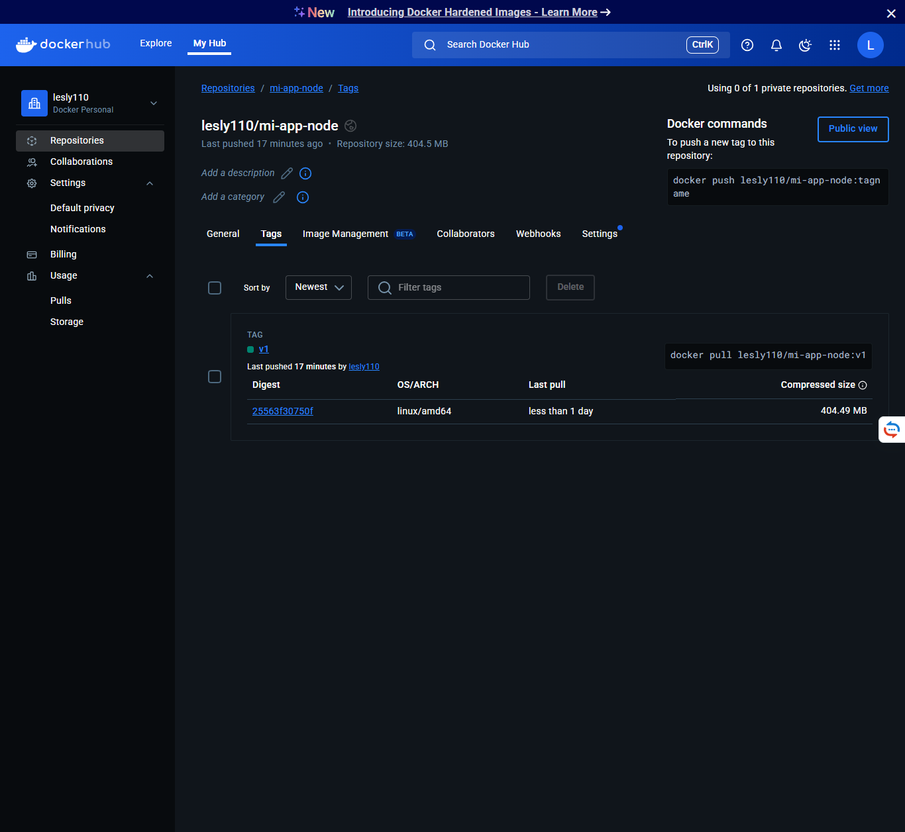

## Imagen Docker

La imagen está disponible en Docker Hub:

[enlace-docker-hub](https://hub.docker.com/r/lesly110/mi-app-node)

Para correr la imagen localmente:

```bash
docker run -p 8080:8080 nombredelhub/mi-app-node:v1

## Captura de pantalla


